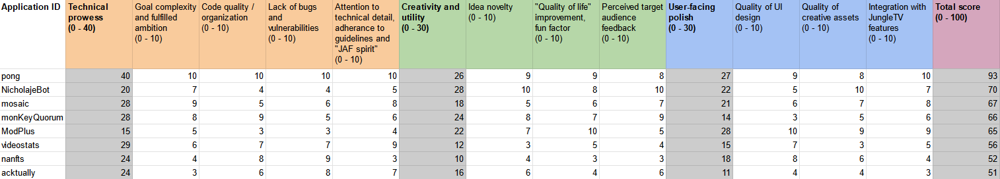

# Boosted AF Winners Announcement!

  <iframe style="position: absolute; top: 0; left: 0; width: 100%; height: 100%; margin: 0" src="https://www.youtube.com/embed/K3WHrBgQreQ?si=s4MDofZagneqM86C" title="YouTube video player" frameborder="0" allow="accelerometer; autoplay; clipboard-write; encrypted-media; gyroscope; picture-in-picture; web-share" referrerpolicy="strict-origin-when-cross-origin" allowfullscreen></iframe>

> The original contest announcement and rules are available [here](boosted_af_original.md).

After two months of competition and one month of submission reviews and judging, the Boosted AF competition has come to an end!
Boosted AF was the first hackathon centered around the JungleTV Application Framework (JAF), which allows both the JungleTV team and third-party developers to easily extend the service with new features.
JungleTV is a media sharing website for the Banano community, where people gather to consume videos and music together (and now play games as well), while spending and receiving Banano.

The contest was open to everyone, including JungleTV team members but excluding the contest judges, and each contestant could submit multiple entries.
The contest was initially announced in the end of March 2024.
Applications could be submitted to the contest between April 19 and June 19, and they were only considered eligible after they passed the approval process that all JAF applications must go through.
This ample period was intended to maximize the number of submissions and to give participants time to familiarize themselves with the JAF and deliver high-quality, polished experiences.
Ultimately, the judges' conclusion is that not only was the number of submissions relatively low, most entries did not really benefit from this large window of opportunity, with some contestants admitting to starting the development of their applications very late, and some submitting entries that were frankly incomplete and unpolished, or simply not the best fit for JungleTV.
This last situation could have been completely avoided if they had followed the advice given in the JAF documentation: to get in touch with the JungleTV team prior to starting the development of a JAF application, to avoid wasting effort on an application that would not be well received.

With the sour notes out of the way, one impressive highlight was the prize pool at stake: the initial prize pool of 100k BAN put forward by the lead developer of JungleTV was quickly increased by the generous donations of community members and these, together with the 50k BAN in donation matching, contributed to a total prize pool of over 237k BAN - all without touching distribution funds! The top 5 places in the contest received an award from this 237k BAN prize pool, as described in the contest regulations, and, aside from that - surprise! The JungleTV lead developer has directly rewarded the remaining submissions with an additional total of 20k BAN, contributing to a **final prize fund of over 250k BAN**!

The judges looked at a total of 8 eligible submissions, from 7 different developer identities.
Only the approved submissions were analyzed by the judges, and only those updates received within the Boosted AF submission window were considered.
However, because the application approval process often includes comments on improvements to be made or restrictions to include, for fairness, the judges were made aware of the messages exchanged during this approval process.

## The results

Let's see how these 8 entries did on the Boosted AF competition, starting with...

### 8th place

**The 8th place - acktually**: This is a very simple chat bot written in about 30 lines of code, which reacts to variations of users saying "JungleTV is dead", a reference to a message often sent in chat whenever the media queue became empty.
Typically - and ironically - the users complaining were those who hadn't really spent any Banano on the service.
The application thus sends a chat reply, showing the statistics for how much the complainer has spent enqueuing media versus how much they have withdrawn in recent times.

This submission was penalized by its extreme simplicity, both conceptual and technical, with the application not even confirming whether the queue is actually empty before sending its reply, and also replying to users who have spent multiple times more Banano than they have withdrawn.
It was also penalized for being nothing more than a repetitive chat bot, a type of application that is discouraged by the chat guidelines presented in the JAF manual.
Finally, the judges noted how, despite the extreme simplicity, the initial submission of the application had bugs that were only caught by the JAF application review team.

### 7th place

**In 7th place, we have nanfts**: this is a viewer for each user's collection of tokens in Nanswap's centralized NFT service Nanswap Art which, we're told, now supports Banano in some capacity.
This viewer presents itself as an additional tab in the profiles of each JungleTV user.

While there weren't many negative remarks from a technical implementation viewpoint, this entry was penalized for having an unclear user experience.
Most JungleTV members who commented on the new feature did not understand its purpose.
There was some confusion around whether there was a connection with proper NFT collections, namely those that had been previously distributed by JungleTV, or with the sadly underutilized Banano NFTs technology.
Alas, this is an entirely unrelated thing.
Some more explanatory text in its UI, particularly in the cases of users who own no "NaNFTs" - the overwhelming majority - would have been welcome.

This entry was also heavily penalized for not really having any connection to other JungleTV features, and ultimately coming across as a cheap plug for an external service, that offered no real benefits or tie-in opportunities to JungleTV, Banano or their communities.
On a positive note, the UI that exists is well designed from a graphical standpoint, and the application overally seemed quite reliable at what it did - even at causing confusion.

### 6th place

**The 6th place goes to videostats**: an application that allows users to fetch some statistics about media previously played, or not yet played, on JungleTV.
In addition to its own application page accessible through a navigation bar entry, the application also makes its functionality available over a chat command which is not really mentioned in any user-facing copy, leading to it remaining basically undiscovered by the community.

The application is quite simple from a technical perspective, largely being little more than a wrapper around a built-in JAF function to search the media history.
It elicited some nudging from the application reviewers in order to avoid wasting computational resources.
This application provides a couple advantages over the built-in JungleTV Play History function, including indicating the user who has enqueued media matching a certain query the most.
Videostats was penalized by its simplistic implementation and design, bad discoverability, and for all the opportunities it missed, namely, to compute and show even more statistics with the data that it is already fetching from the Play History.

### 5th place

**In 5th place, we have ModPlus**: this is the only moderator-facing application that was eligible for the contest.
It is a multi-purpose assortment of varied moderation tools, mainly focused in automating certain event hosting tasks.
For example, ModPlus could ensure that Tunesday always starts on time - even if the event organizers are asleep, opening the way to events hosted at more varied times!
It also has the potential to make the process of judging and sending out rewards for events much easier, by involving the community in the judging process - a plus for everyone involved.

This submission was highly praised by its ambition and goals, being exactly what different JungleTV staff members had been asking for, over the years.
Sadly the good news end there: the submission was in very rough shape, coming in extremely late and barely within the contest submission window - making us double-check timezones for a bit - and riddled with missing or broken functionality.
There was a lot of code and it was poorly organized, to the point where the application author felt the need to inform the review team of which files not to look into! (Unfortunately for everyone but the security and safety of the JungleTV platform and its users, the reviewers still had to take a look through everything.)

Surprisingly, this application had the some of the best UI design of all the submissions, particularly when we take the complexity of features it needs to expose.
This submission reached fifth place after carefully considering the balance of its ambitious and desirable goals counterpointed by its low technical quality, the unfairness of being the only moderator-facing application submission (we can't quite measure community engagement with this one...) and our confidence that the author will continue to develop ModPlus over time, so that it will actually deliver on all of its promises.

### 4th place

**The 4th place goes to monKeyQuorum**: this is an entry by someone who certainly noticed that "voting" figured as a capability on the initial JAF teaser video, and decided to do it justice.
monKeyQuorum is a barebones message board where each user can have up to four text posts up for other users to upvote or downvote.
The initial submission of this application had some serious security issues that had to be pointed by the review team.
Its visual design also leaves something to be desired and some users have criticized this application for frequently spamming its "notification dot" on the JungleTV navigation bar, as well as adding one extra tab to the sidebar, for something that probably would not need it.

This submission was penalized for missing some opportunities for integration with other JungleTV features, such as requiring JP to be spent to post messages and/or vote on them.
It could also, for example, post each message to chat and making it possible for users to vote directly from there - such feature could even replace the annoying frequent use of the "notification dot".
Perhaps due to this sidebar tab making it extra obvious, this application has some of the highest community engagement, but this is both a blessing and a curse: with messages not expiring automatically, and considering that nothing is infinitely scalable, it won't be long before the JungleTV team has to manually purge them in order to preserve the service's performance.

### 3rd place

**Ranking in 3rd place, we have mosaic**: a bootleg of r/place, for JungleTV, with just a fraction of the board size and lukewarm community engagement... but containing additional bugs to make up for it.
While the code isn't poorly organized and no major bugs were caught during the review process, in production multiple problems were observed, including the game not starting on time once its queue entries enter the esteemed JungleTV stage.
JungleTV users have lamented the reduced size of the board and JungleTV moderators have also noted a lack of moderation options - they are only able to blank the entire canvas as opposed to just a moderator-defined portion.
Users being able to spend JP to skip cooldown periods is a nice touch, but since the cost doesn't scale with the repeated use of the ability (or any other factor, like the player's JP balance), it can lead to excessive imbalance between participants.
The game is also not friendly to mobile/touch-screens.

In general, the judges would have definitely liked to see a bit more polish than what this submission presents.
Because there are few users on the board at a time - JungleTV is sadly still not as big as Reddit - we lament that no additional "twists" on the genre were introduced.
For example, the game could propose certain patterns to draw on each round, and give extra rewards to those who managed to get them drawn.
Redeeming factors included the application's use of the JP system, the application's sensible discoverability choices (through the use of a navigation bar button) and, last but not least, the fact that mosaic matched the kind of new experience that JungleTV team had in mind, when the JAF was introduced.

### 2nd place

**The 2nd place goes to NicholajeBot**: when the JungleTV team was approached regarding the idea of a chat bot dedicated to imitating a member of the community, skepticism abounded, but the green light was still given.
After seeing the end result, the judges are glad this was the case.
The application authors took care to implement every suggestion about how to make their chat bot more acceptable within the JAF guidelines.

While unremarkable from a technical perspective, with unorganized code and some sections which, we're pretty sure, don't quite work as the author thought they would, the chat bot is very good at imitating the random, often chaotic messages sent by the actual human/monkey it is imitating.
That is really where it shines: the quality of its creative assets, if you can call them that, and the creativity of the entire idea.
It will (sometimes) interact with you if you reply to its messages, or if you enqueue a video it particularly enjoys... but only if it's feeling like it! The power of bugs and/or randomness functions really can't be overstated.
Besides, this application actually is more than a chat bot: it will also take care of enqueuing videos when the queue is empty for a long time, and it will actually make use of the application wallet funds so that its entries have a corresponding BAN reward - just like those enqueued by actual monkeys.

Virtual pets weren't really on JAF's bucket list when it was introduced, but we suppose that Nicholaje is pretty close to being one - and the feedback from the community seems positive, in general.
Our legal team advised us not to mention which user this submission is meant to imitate, but we hope that the application author shares some of the proceedings from the contest with them, in lieu of a preemptive payment for their personality rights.

### 1st place

**And lastly but with great fanfare, the 1st place goes to pong**: the first commercially successful video game gets an adaptation for the JAF, technically becoming a massive multiplayer online game! Submitted by the author of acktually, they manage to score both the first and last place in the contest - looks like their hedge betting strategy paid off.
pong is remarkable from a technical perspective, doing something that the JAF authors weren't quite sure was possible to implement on the platform - a multiplayer game with simple synchronized physics.

The code is well organized and has good overall quality despite the complexity of the task at hand.
It doesn't appear to have any serious bugs and even received multiple updates within the contest submission window, so its best version (so far!) ended up being the one the judges evaluated.
This was one of the few entries which shows that it took advantage of the over two months of development time allowed by the contest.
It was the only submission which made the JungleTV developers feel that the JAF was the limiting factor - for example, if applications had the ability to better control the payouts from their queue entries, this application would present a better user experience.

Pong integrates with other JungleTV features, letting users spend JP, and making use of the application wallet not just to set rewards for its queue entries, but also to send rewards to particularly good players on each round.
The page to enqueue pong is easily discoverable through the JungleTV navigation bar.
And while making the game mobile-friendly was always going to be a bit of a challenge, it is at least playable on larger touch-screens such as those of tablets, and it properly scales down the playing field to fit the smallest of screens without major issues.

The game was well-received by the JungleTV community, and continues to gather players every time it is enqueued, even though the novelty factor wore off months ago.
The only thing we feel could be more fleshed out is the visual style, which comes across as very simplistic, but in line with the 1972 original.
The HUD could be easier to read, as well.
It would also have been nice to introduce some form of power-ups, special abilities or alternate game modes - though this is probably already asking for too much, from a submission that scored very well in all criteria, particularly the ones connected to technical prowess.

### Final scores

Here is the final score matrix:

After some entries kept getting tied for 5th place, and lots of debate, the judges settled on a system where, for each criteria, applications would be sorted from best to worst.
The best application would receive 10 points for that criteria, 9 would go to the second best, and so on. With eight submissions, this did mean that the scale for each criteria effectively goes from 3 to 10 rather than 0 to 10.

## The rewards

Now that we have appropriately roasted all the entries, it's time to see how much each submission earned their authors:

| Place     | Application  | Prize                                      |                                                                                                                |
| --------- | ------------ | ------------------------------------------ | -------------------------------------------------------------------------------------------------------------- |
| 1st place | pong         | 71300 BAN (30% of the official prize pool) | [send block](https://creeper.banano.cc/hash/0349AC9CA1D965AD7ED533FE7441ADF8F6FBEF104004BCD55B4BFBCE5A03EB52) |
| 2nd place | NicholajeBot | 59417 BAN (25% of the official prize pool) | [send block](https://creeper.banano.cc/hash/81E65876B25C420C387895192573492B30306830BA3FA81BDE019D2CC6670A0F) |
| 3rd place | mosaic       | 47553 BAN (20% of the official prize pool) | [send block](https://creeper.banano.cc/hash/B1A3001B59CD209B3FD2A5E9F8E73F8C6CD6D1E988C2C711942BFF0C3A2D83BF) |
| 4th place | monKeyQuorum | 35650 BAN (15% of the official prize pool) | [send block](https://creeper.banano.cc/hash/2B4DF0381A44FCE1BBF8307EEAA3F0F4209D4B62696026FE236B83C254C8AED2) |
| 5th place | ModPlus      | 23766 BAN (10% of the official prize pool) | [send block](https://creeper.banano.cc/hash/6AE8924ACCFD9496F25D1150E4C079DE081CBEEC2CD33BB8C0E48112DA8737E5) |
| 6th place | videostats   | 15000 BAN (75% of the sur*prize* pool)     | [send block](https://creeper.banano.cc/hash/9232E8FB1B6FE030821C6CC4F2051E010A0ADB47894A41C0F8F0EC67200148DF) |
| 7th place | nanfts       | 3000 BAN (15% of the sur*prize* pool)      | [send block](https://creeper.banano.cc/hash/E2390A7CB68C0366E371CF50DA4E433CB11EE97F17A89BAACA45A9ED59CDF43A) |
| 8th place | acktually    | 2000 BAN (10% of the sur*prize* pool)      | [send block](https://creeper.banano.cc/hash/B0A894415E89C06D5CBD182F34038123EF1FA3A4AA6991D51FAEF5760BE59A5A) |

## Closing words

We believe that the Boosted AF contest was, overall, a positive event for the JungleTV and Banano communities.
In some ways, the outcome positively surprised us: we were not expecting such large donations to the prize pool, and the participants requested much less hands-on help than we anticipated, reducing the burden on the JungleTV team.
With a total prize pool of over 250k BAN, we believe this was one of the events with the largest prize pool in the history of Banano, that did not directly involve Banano from the distribution funds.

In spite of that, we can't hide the fact that not all metrics met our expectations, particularly when it comes to the number of submissions.
In retrospective, the JungleTV team should have put more effort into advertising the contest outside of the JungleTV community and even outside of the Banano community, to reach a greater number of developers.
Additionally, we should have reiterated the importance of starting the developments of the projects earlier in the contest timeline, rather than allowing almost everyone to seemingly start working on their projects two weeks away from the deadline.
Requiring some form of project registration (not unlike what organizers of the Banano Booster contest do), or perhaps even having more of a motivational theme for the contest, could have helped with these challenges.

Nevertheless, we are extremely grateful for the energy the participants put into this event, and for the generous donations to the prize pool - thank you all!
We now have a number of quality applications that can be used to demonstrate the capabilities of the JAF, hopefully inspiring others to develop for JungleTV, and informing the JungleTV team on which areas of the JAF need the most improvement.
The Boosted AF contest was always planned to be a one-off event, and while it is very unlikely that it will return with the same format, we will be exploring other ways to motivate and sponsor the development of new JAF applications and updates to existing applications.

The JungleTV team hopes that everyone enjoyed the Boosted AF contest and the projects that came out of it! We are looking forward to experiencing more inspired innovations, built on top of Banano and/or the JungleTV Application Framework!