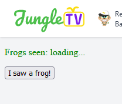

# Example application: Counting frogs

Now that the basics of how to create, edit and launch applications in JungleTV have been presented, in this second example, we're going to build something slightly more complex and interesting, that can actually showcase some unique capabilities of the JungleTV Application Framework.
We are also

In this section, we are going to develop an application that adds a new page to the JungleTV website, with a counter and a button.
Every time someone presses the button, the counter will increment by one.
The updated count will be reflected on the devices of every user who may be looking at the page.

## Warming up

As with the previous guide, you should create a new application.
Give it an ID of `counter-` followed by some numbers; this guide will use `counter-4219`, but you are encouraged to choose different numbers.
After doing so, take the opportunity to edit the application properties to make it launchable.

Now, if you wish, you may follow the rest of this guide using the application editor built into JungleTV, as we did in the previous example.
However, we believe this is a good time to recommend the usage of the other application editor at your disposal: the VS Code-based web editor available at [editor.jungletv.live](https://editor.jungletv.live).
This example will require editing multiple files and going back and forth between them, and this other editor is better suited for that.
If you have not done so already, you should follow the [instructions in the manual](../manual/environments_editors.md#using-the-editor) to set this editor up.
When you are done, come back here.

After configuring the staging environment on the editor, you should add the `counter-...` application you created to your editor workspace.
As described in the instructions, you do this by pressing F1 on the editor, searching for "Add application to workspace", and then selecting the right environment and application from the lists.
You should get to the point where you see the newly created application on the sidebar explorer view:


## Creating the files

This example application will require at least three files: in addition to the `main.js` that the JAF already created for us, we're going to need a `client.js` file and a `counter.html` file.
In this editor, you can create files by, for example, right-clicking the "Application counter(...)" row on the explorer view and selecting "New File...".
You will be prompted for the file name, and after that, three more prompts will appear asking for the "MIME type", whether the file is "Public" or "Private" and an edit message.

Create the files as follows:

- **client.js**
  - MIME type: `text/javascript` (as suggested by the editor)
  - Should be Public

- **counter.html**
  - MIME type: `text/html` (as suggested by the editor)
  - Should be Public

So, what was this about? Let's start with the "MIME type".
As was briefly mentioned in the earlier [overview](./overview.md#concepts-applications-editors-pages-and-files) section, files in JAF applications have an associated [MIME type](https://developer.mozilla.org/en-US/docs/Web/HTTP/Basics_of_HTTP/MIME_types). This is a standardized string indicating the nature of a file; think file extensions, but disconnected from the file name and slightly more structured.
It is important to select the right MIME types for your files, as your applications won't work properly otherwise.
The editors generally try to guess an initial adequate MIME type based on the extension of the files you create, and this is why the editor pre-filled the MIME type prompts with `text/javascript` and `text/html`.

The distinction between "public" and "private"/"internal" has to do with whether the file is meant to be accessible to the users of your application.
Files that are going to be served over HTTP, namely because they will be used by an application page, need to be marked as Public.
Files that contain the server-side logic and configuration of your application should remain Internal.

> **Note**: On the VSCode-based editor, you can adjust these properties on already created files, by right-clicking them and selecting "Set MIME Type..." and "Make File Public" / "Make File Internal".
> 

> **Note**: If you are following along using the built-in editor, the easiest way to create files is probably to duplicate an existing one.
> Or you may open the code editor on an existing file, and edit the URL on the address bar to point to a non-existent file name, at which point you'll be sent to an empty editor - the file creation process will happen on the first save.
> In the built-in editor, you can edit the MIME type of the files and their Public setting, by going into their "Details" view, accessible from the file list.

## Creating the application page

Our example application will have a single page, where users will be able to view and increment the counter.
As you may have guessed, the `counter.html` and `client.js` files we created are related to this page.

Enter the following code on `counter.html`, where we define the layout of the page and what scripts it should execute in the users' browsers.

```html
<!DOCTYPE html>
<html lang="en-US">
<head>
    <script type="text/javascript" src="**appbridge.js"></script>
    <script type="text/javascript" src="client.js"></script>
</head>
<body>
    <p style="color: green">
        Frogs seen: <span id="counterSpan">loading...</span>
    </p>
    <p>
        <button type="button" id="incrementButton">I saw a frog!</button>
    </p>
    <p>&nbsp;</p>
</body>
```

Here, we are bringing in two scripts into the application page.
The first one is provided by the JAF itself, with that special name; it is the [appbridge script](../manual/pages.md#client-side-framework-appbridge) and it allows the page to communicate with the rest of JungleTV and with the server-side logic of your application.
The second one is the other file you've just created.

After that, we're defining elements where to display our counter value and a button that users can click, but nothing will really happen with these unless we use them from a script.
So, on `client.js`, enter the following code:

```js
let counterSpan;

async function onButtonClick() {
    let newValue = await window.appbridge.serverMethod("increment");
    counterSpan.innerText = newValue + "";
}

function onCountUpdated(e) {
    counterSpan.innerText = e.detail[0] + "";
}

function onLoad() {
    counterSpan = document.getElementById("counterSpan");

    document.getElementById("incrementButton").addEventListener("click", onButtonClick);

    window.appbridge.server.addEventListener("countUpdated", onCountUpdated);
}

document.addEventListener("DOMContentLoaded", onLoad);
```

There are lots of things to unpack here, especially if you are newer to JavaScript and web development in general.
Let's start from the bottom.
On the last line, we're setting the `onLoad` function to run when the page's elements (which we've defined on `counter.html`) finish loading.
In that function,
- we are obtaining a reference to the element where we'll show the count, `counterSpan`, and setting it on a global variable so that other functions can easily use it;
- we are setting the `onButtonClick` function to run when the button we added to the page is clicked;
- and we are setting the `onCountUpdated` function to run whenever the page receives a `countUpdated` event from the server. This is what will take care of updating the displayed count whenever anyone presses the button on their browsers.

In the `onCountUpdated` function, we are setting the content of our counter span to the value sent with the event.
Events sent by the server logic can have multiple arguments, hence why the `detail` field is an array.

Finally, in the `onButtonClick` function, we are calling a server-side method called `increment`, and displaying the value returned by it on the counter span.
This is an asynchronous function, because invocations of remote functions return a Promise; the async/await syntax lets us easily deal with promises.

Now, we have the client-side aspects of the application page ready.
But if we were to launch the application, there is no way we'd be able to see this page at all, and even if we could, it wouldn't function - we are yet to add the server-side logic.
So let's take care of that.

## The server-side logic

On the `main.js` file, add the following code:

```js
const pages = require("jungletv:pages");
const rpc = require("jungletv:rpc");

let counter = 0;

function increment() {
    counter++;
    rpc.emitToPage("counter", "countUpdated", counter);
    return counter;
}

rpc.registerMethod("increment", "unauthenticated", increment);

pages.publishFile("counter", "counter.html", "Example counter");
```

Once again, there is quite a bit to unpack here.
This time, let's start from the top.

The first two lines are bringing in JavaScript modules that are part of the JAF runtime: the [`jungletv:pages` module](../reference/server/jungletv_pages.md) and the [`jungletv:rpc` module](../reference/server/jungletv_rpc.md).
Put simply, the first one allows you to publish and unpublish application pages - i.e. actually control whether a certain public HTML file is available as a proper application page, with its own URL.
The second one contains all the methods needed to communicate in real-time with said application pages.

Next, we are defining the variable for our counter - no surprises here.
The `increment` function follows - it is responsible for incrementing the counter whenever it runs, and by broadcasting the `countUpdated` event to the application page with ID `counter`.
The updated counter value is sent as an argument in this event.
Finally, the function returns this value.

Just defining a function called `increment`, or anything else for that matter, wouldn't be sufficient to make it callable by the client-side logic in application pages.
The next line of code calls `rpc.registerMethod`, and essentially tells the JAF runtime that whenever it receives a remote invocation of a function called "increment" (the first argument), it should run the `increment` function we've defined earlier (specified in the third argument).
We are also telling it that users do not need to be registered to receive rewards in order to call this function - hence the "unauthenticated" as the second argument.

The last line of code is finally making our `counter.html` file available as an application page with ID `counter`, and a title of "Example counter".
This is what makes the application page available and functional on its own dedicated URL.

> **Note**: Applications are able to publish and unpublish pages, and register/unregister method and event handlers at any point during their execution.
> These calls do not need to happen right as the application starts.
> Server-side event and method handlers are also able to get information on the user that triggered them.
>
> For more information on application pages and client-server communication, you should see the relevant manual pages:
> - [Application pages](../manual/pages.md)
> - [Client-server communication](../manual/rpc.md)

## Testing the application

After saving all files, it's time to launch the application and see if it works as expected.
You can do this straight from inside VS Code, by pressing F5 while editing a JavaScript file.
You should see the debugger view come up.
Even though JAF applications can't be debugged "like that", it still takes advantage of the debug console to show the application console - the same one you can see through the built-in editor.
You can type expressions on this debug console to evaluate them in the context of the application.
You can also use the controls at the top to restart or stop the application.


With the application running, visit the following URL - you will need to replace `counter-4219` with the ID you used for your application:

`https://staging.jungletv.live/apps/counter-4219/counter`

You should see something like this:



Well, that doesn't look very right.
But whenever you click the button, you will see the counter increase.
And if you open additional tabs, you'll see the counter increase simultaneously on all of them.
You can also try calling `increment()` directly on the application console, and the counter will update on all open pages.

Let's fix the "loading" problem by making the pages obtain the most recent counter value when they are loaded.
There are multiple ways you can do this.
For example, you may define an additional method, e.g. `getCount` which returns the current count without incrementing it, and have the client-side script call that remote method when it loads.
We are going to present an alternative approach, that shows that server-side logic, not just page scripts, can receive events too.

Add the following code to the bottom of `main.js`:

```js
function onConnected() {
    rpc.emitToPage("counter", "countUpdated", counter);
}

rpc.addEventListener("connected", onConnected);
```

`connected` is the name of a special event that is emitted by the JungleTV AF runtime itself, whenever an application page connects to the server; there is a corresponding `disconnected` event.
This code makes it so that when a client connects, the server logic immediately sends an event with the current counter value.
(This event is sent to all connected clients and not only the one which just connected, but that is not a problem here.)
This has the added benefit that, if the connection between the client page and the server has a temporary issue and needs to be reestablished - something managed by the appbridge script - the counter will be updated to the correct value as soon as the page reconnects.

> **Note**: it is possible for clients to emit events with the names `connected` and `disconnected`, too.
> Usually, you should ensure that the events have really been emitted by the runtime and not by a client, by checking the `trusted` field of the context argument, which is the first argument passed to event handlers.
> See [the relevant reference section](../reference/server/jungletv_rpc.md#events) for details.

Once you save the file and restart the application, you will see two things:
- If you still had the application page open in your browser, it has probably turned into a 404 page - this is because when applications are stopped, their pages are automatically unpublished, and page unpublishing is reflected immediately on all the connected clients.
  You'll need to reload the page to see the application page again.
- As soon as the application page loads, the counter value will now be shown, as expected.

## Persisting data

You probably noticed how, after you restarted the application, the counter value went back to zero.
This is because the counter is a simple in-memory variable, whose value is lost as soon as the application restarts.
For the counter to persist across application executions, we need to add some more bits of code.
We have three changes to make to `main.js`:

- Near the top of the file, add a new line:
  ```js
  const keyvalue = require("jungletv:keyvalue");
  ```
  This is just bringing in a new JAF module, the one responsible for data persistence.

- Replace `let counter = 0;` with the following:
  ```js
  let counter = parseInt(keyvalue.getItem("counter") ?? "0");
  ```
  This will read the previously-saved counter value from storage.
  The call to `parseInt` is needed because values are saved in storage as strings.
  The `?? "0"` part is because `getItem` will return null when the key doesn't exist; this way, we make it so that `counter` starts at 0 and not as NaN (i.e. the result of `parseInt(null)`).

- On the `increment` function, after `counter++;`, add the following line:
  ```js
  keyvalue.setItem("counter", counter);
  ```
  This saves the counter value to storage as soon as we update it.
  This way, the application can be stopped at any point with no data loss.

In summary, these changes make it so that the value of the counter is persisted to the key-value storage that is private to each application, with the key name `counter` and the value being simply converted to and from string.
You would also be able to save more complex values, by e.g. converting them to and from JSON, using `JSON.stringify` and `JSON.parse`.

Once you save the file and restart the application, the counter will be back at zero again.
But increment it a few times and restart the application, and you should see that the counter retained its previous value.

## Going above and beyond

While this is all we had for this slightly more complex example, you are encouraged to continue playing around with it.
Here are some ideas for things you may want to try yourself, particularly after you continue reading through this documentation:
- Only letting users who are registered for rewards increment the counter;
- Only letting users who are subscribed to JungleTV Nice increment the counter;
- Only letting each user increment the counter once;
- Showing the page in a JungleTV homepage sidebar tab;
- Splitting your server-side logic into multiple files;
  - You can use `require("./somefile.js")` to import other files within your own application.
- Using TypeScript instead of JavaScript - there is an entire manual section on [language support](../manual/languages.md);
- Styling the counter page to fit more with the rest of JungleTV - the [app bridge custom elements](../reference/appbridge/elements.md) will be your friend...

Once you are done with this example application, remember to delete it from the staging lab environment (perhaps after exporting a backup, of course).