# Example application: Hello JungleTV

Now that the basic concepts have been introduced and you have a lab environment ready to use (if not, [check the previous section](./resources.md#lab-environment)), you can begin getting your hands dirty with the JungleTV Application Framework.
This section will guide you through the creation and execution of your first JAF application, presenting the application management and development features as we go along.

To follow this guide, you should be using a device like a laptop or desktop, as the application editor is not designed for handheld devices.

## Creating your first application

Open the application manager by pressing the "Manage applications" link on the moderation dashboard (or access [this link](https://staging.jungletv.live/moderate/applications) directly).
You should see a screen similar to this one:

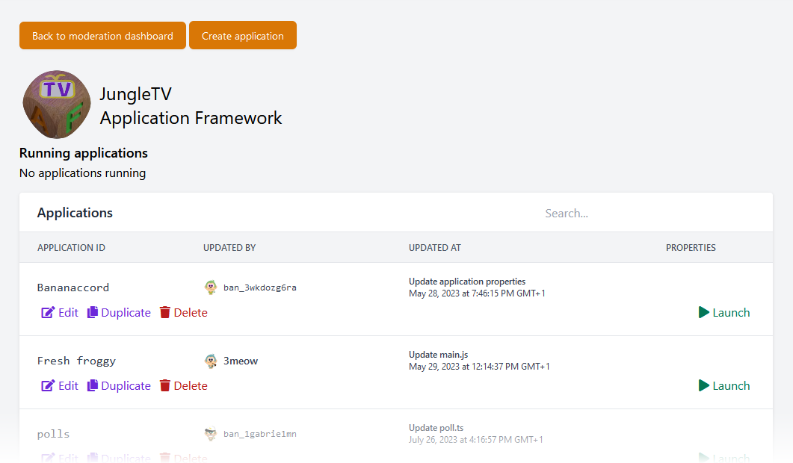

In addition to listing the applications present in this JungleTV environment, this screen lets you create, launch, stop and delete applications.
Each application must have a unique ID that may be shown to JungleTV end users.
If you are using the staging lab environment as this guide suggests, you will most likely see applications created by other developers.

Let's create a new application by pressing the "Create application" button at the top of the page.
A pop-up like the one below will appear:

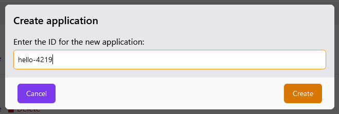

Enter `hello-` followed by some random numbers, as to not collide with other users who may be following this guide.
This guide will use `hello-4219` but you are encouraged to use a different name.
After confirming, the application you just created should now appear in the list (if there are many applications, you may need to search for it using the field in the top right corner).

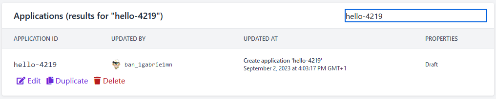

## Editing your application

On the application list, click the application name or its "Edit" button.
You will enter the application detail page, where you can manage the files of the application, edit its properties and backup or restore it.
Newly created applications come with a single file, `main.js`.
Applications must have a `main.js` or `main.ts` (if writing TypeScript code) in order to be executable.

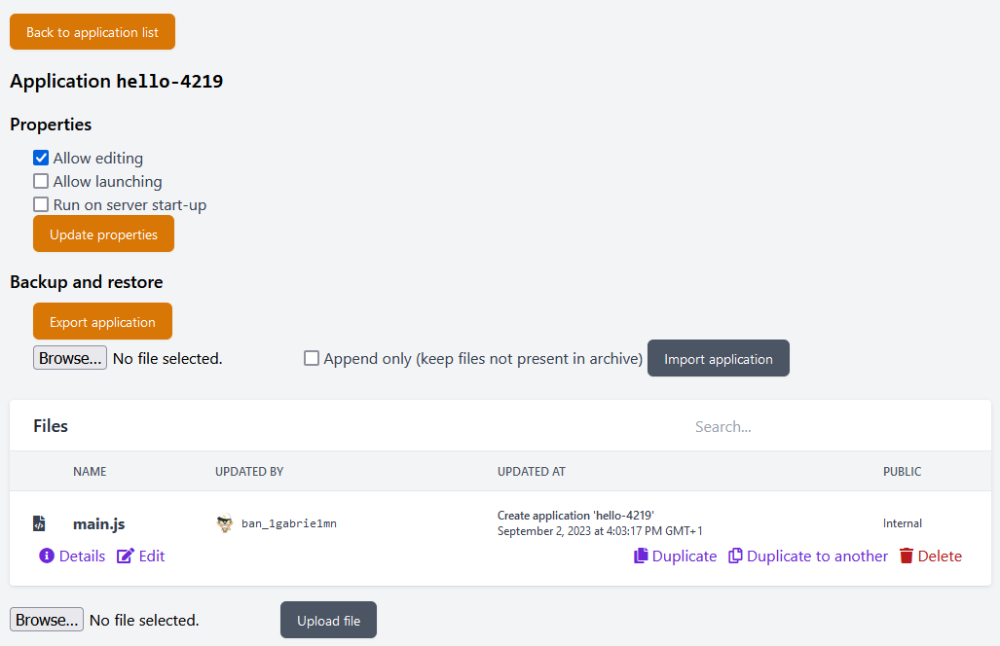

In order to be executable, their properties must also be set to "Allow launching" - let's take care of that now.
Tick the appropriate checkbox, and press "Update properties":

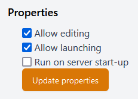

You will see a prompt asking you for an "edit message".
After every change to an application or its files, a new version of the application is created.
That version is associated with an _edit message_, which you should use to briefly describe what you just changed.
If you have used version control systems such as Git before, this serves the same function as a commit message.

Enter a suitable message and proceed:

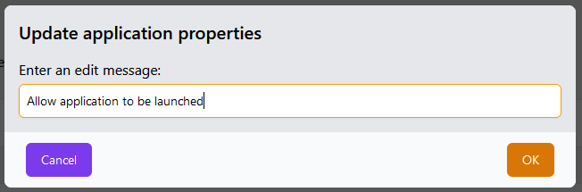

> **Note**: right now, it is not possible to navigate through past application versions or restore them.
> However, all application versions are already being stored and this functionality will become available in a future JungleTV AF update.

Now that you should be seeing the application file list again, let's press "Edit" on `main.js`.
You should see a screen similar to the following one:

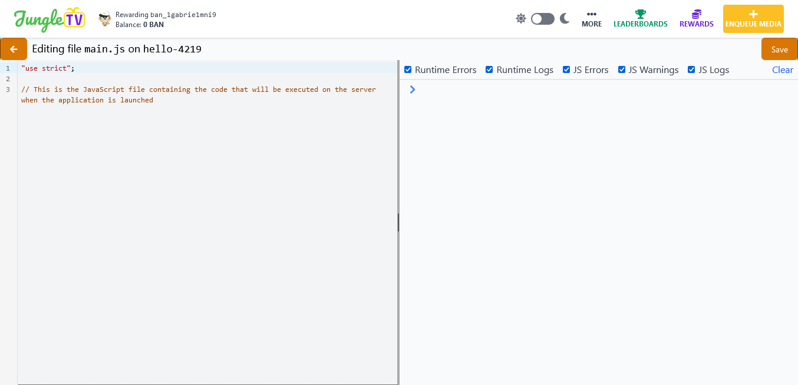

This is the code editor built into the JungleTV SPA.
It is not very advanced compared to modern desktop code editors, but it is sufficient to develop simple applications and make basic changes to existing ones.
The left half of the page shows the content of the file, and the right half is the application console.
The application console lets you interact with the application's server-side JavaScript environment while it is running - just like how the console within your browser's developer tools lets you interact with the JavaScript environment of the web page.
We'll explore the application console in a bit.
For now, enter the following code on the right pane, below what is already there:

```js
function hello(name) {
    console.log(`Hello ${name}!`);
}

hello("JungleTV");
```

Now, press the "Save" button near the top right corner of the page.
As before, you will be prompted for an edit message - there will be one pre-filled for you, but you should change this to something more descriptive when possible, particularly when you reach some form of phase or milestone in the development of your application.
After entering the message, you'll receive a confirmation that the file has been saved.
Go back to the application details screen by pressing the arrow near the top left corner of the page.

## Launching your application

At the top of the application details screen, near the application ID, press the green "Launch" button.
It will only be visible if the application properties are set to allow the application to launch, as we've done before.

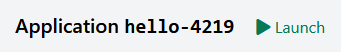

If you have followed the guide correctly so far, you should see three different buttons appear:

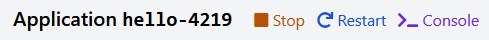

Press the "Console" button, and you should be taken to a page that is similar to the right half of the code editor we've seen before.

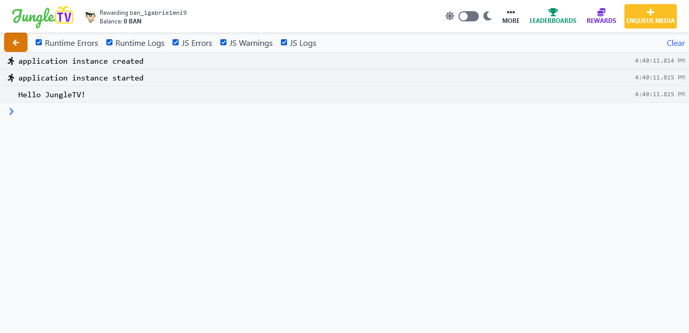

The first two messages were logged by the JungleTV AF runtime itself; the third message was produced by the code you entered in `main.js` before.

In addition to showing messages logged by the application and the JAF runtime, the console lets you interact with the application's server-side JavaScript environment.
You can execute any JavaScript expression by typing it at the bottom and pressing Enter; it will run in the event loop of the application and the result will be sent back to the console.
For example, you can call the `hello` function we've defined in the code, with a different argument:

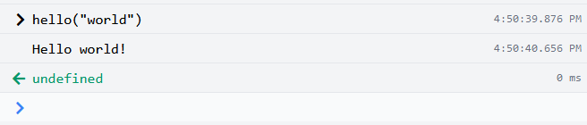

In the image above, the top line is the expression we've entered to evaluate.
The timestamp to its right is the time at which you entered the expression to be executed.
The second line corresponds to the [`console.log`](../reference/server/node_console.md#log) call within the `hello` function, and the time at which the message was logged.
The third line corresponds to the result of the expression, which is the return value of the `hello("world")` call - it's `undefined` because the function does not return anything.
To its right you can see how long the execution of the expression took (this is measured on the server and does not take into account the latency between your browser and the server).
If you place your mouse cursor over either the expression or the result rows, they'll be highlighted.

Feel free to continue exploring the application console.
For example, if you enter invalid expressions or expressions that cause exceptions, you'll see them in the console as well:

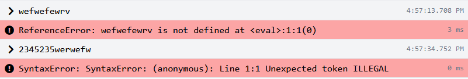

To leave the application console and go back to the application details screen, press the arrow near the top left corner of the page.

## Editing your application, again

Let's go back to editing the `main.js` file, and change the code to say "Hi" instead of "Hello":

```js
function hello(name) {
    console.log(`Hi ${name}!`);
}

hello("JungleTV");
```

As before, press "Save", accept the pre-filled edit message or enter a different one, and then you should see the following prompt:

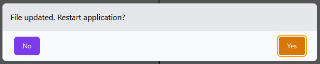

The editor is asking you whether to restart the application as a convenience.
Before, we've explained how every change to an application corresponds to a new version of that application.
When you launch an application, you are specifically launching its most recent version.
When you edit one of its files, you are creating an even newer version of the application.
**Any** changes made after an application is launched will not be reflected until you restart it.
So, when the application is already executing, the editor asks you whether to restart it as both a reminder and a convenience, should you want to immediately see the changes in effect.

Press "Yes" and you will see log messages indicating that the application was stopped and started again, and the most recent log entry should say "Hi JungleTV!" instead of "Hello JungleTV!"

Feel free to continue exploring the application console and the code editor.
When you are done, press the arrow near the top left corner of the page to return to the application details screen.

## Backing up

> **Note**: this section of the guide is both the shortest and probably the most important one.

The staging lab environment is shared by multiple developers and both mistakes and malice might, unfortunately, be present.
Every once in a while, or at least at the end of each development session, you should back up your application.

On the application details screen, there is a "Backup and restore" section.
Pressing "Export application" will trigger the download of a ZIP file containing the most recent version of your application's files.
If you later need to restore the application from this archive, you may use the form below that button.
Refer to the [Application import/export manual section](../manual/import_export.md) for more information.

## Cleaning up

Let's keep the public staging environment nice and tidy by deleting the test applications we no longer need, such as the one we created in this guide.

Unlike all other changes to an application, which a future JungleTV AF version will allow to undo via restoration of older application versions, **application deletion is not reversible**.
Deleting an application deletes all of the application data **including older versions**.
After deletion, an application can only be restored by importing it from an archive, as mentioned previously.

Look for your application in the application list:

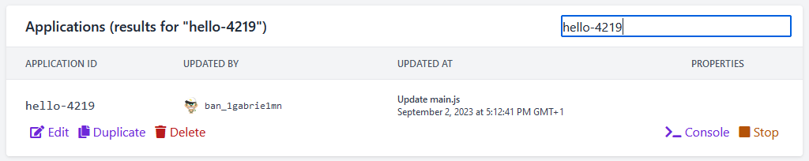

Before deleting an application, it must be stopped - otherwise you will receive an error.
So, begin by pressing the Stop button to the right.
Then, press the red Delete button.
You will be prompted to enter a confirmation message:

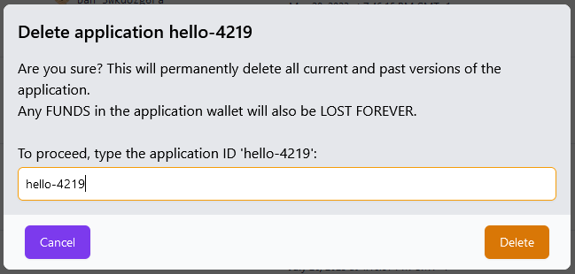

After confirming, your first JungleTV AF application will be gone forever - at least, until you recreate it and restore it from a backup you should have previously created.

---

This concludes the guide to your first JAF application!
There are still plenty of things to learn, and a completely different application editor to discover.
We'll take a look at those in the next section, where we will create a more complex application with less hand-holding.

If you feel you are not ready to move forward - that is completely normal.
Feel free to repeat this guide and explore more, using this simpler application as a base, before moving forward.
Also don't forget that the JungleTV AF community can help you - see how to reach out in the [first page of this documentation](/README.md#get-in-touch).