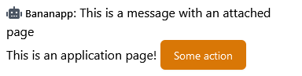

# Chat interaction

The chat is one of the most used features of JungleTV, and is the main vehicle for interaction between users in the community.
JungleTV AF applications are able to interact with the chat, and use it as part of their user interface.
However, application developers should keep in mind that the chat can sometimes become quite active.
It is undesirable for application-created messages to drown out user discussion, and at the same time, messages sent by users may obscure application-created messages.
Because of this, there is a set of [guidelines](#usage-guidelines) for how applications should use the chat.

## Sending messages

Interaction with the JungleTV chat happens through the [`jungletv:chat` module](../reference/server/jungletv_chat.md).
Applications can send messages in chat using a variety of functions, the most simple of which is [`createMessage()`](../reference/server/jungletv_chat.md#createmessage).

Messages appear as having been sent by the application; by default, the application ID is used as the chat nickname.
Applications can set their chat nickname using the [`nickname`](../reference/server/jungletv_chat.md#nickname) property.

```js
// Server code

const chat = require("jungletv:chat");

chat.nickname = "Bananapp";
chat.createMessage("This is a chat message");
```


As with messages sent by users, applications are able to reply to other chat messages (using the optional argument to `createMessage()`) and users are able to reply to messages sent by applications.
To see replies and messages to reply to, applications need to [consume chat messages](#reading-messages).

The JungleTV client SPA will parse message content using a restricted subset of [GitHub Flavored Markdown](https://github.github.com/gfm/).

### Attaching application pages

Applications can attach one of their published pages to the chat messages they send, using [`createMessageWithPageAttachment()`](../reference/server/jungletv_chat.md#createmessagewithpageattachment).
This is meant to allow for rich content within messages, including elements with which users can interact without leaving the chat interface.
When attaching an application page, the height in pixels the page should take below the message must be specified.
The maximum height is 512 pixels.
This is the height of the container where the page is displayed, it will be used regardless of the actual rendered height of the page within.

```js
// Server code
const chat = require("jungletv:chat");
const pages = require("jungletv:pages");

pages.publishFile("some-random-id", "page.html", "Example");

chat.createMessageWithPageAttachment(
    "This is a message with an attached page", "some-random-id", 40);
```

```html
<!DOCTYPE html>
<!-- File page.html, with MIME type text/html and marked as public -->
<html lang="en-US">
<head>
    <script type="text/javascript" src="**appbridge.js"></script>
</head>
<body>
    This is an application page! <jungletv-button>Some action</jungletv-button>
</body>
```



Messages with page attachments are allowed to have an empty content field, i.e. the first argument to the `createMessageWithPageAttachment()` may be empty, in which case only the attached page is displayed below the application nickname.

Keep in mind that during periods of high activity, chat messages can keep scrolling by.
Users may have a very limited window to interact with chat messages, so keep any interactive elements easy to understand and use.
Users on smaller screens may also have trouble interacting with tall chat messages.

When designing pages to attach, and when selecting the height used for their container, you should also keep in mind that the chat area may have a wider width than that used when the chat is displayed in the sidebar of the homepage on wide screens: the chat may be popped out to a separate window, or users may be using a screen that's sufficiently narrow to move the sidebar tabs below the player, while still keeping them wider than the default sidebar width.
On the opposite end of the concern, attached application pages **are not expected to deal well with an area narrower than the width of the homepage sidebar (350px)**.

If an application page attached to a chat message is unpublished while the message is still visible, the attachment will disappear from the message, leaving just the application nickname and the main message content.

### System messages

In addition to regular chat messages that appear quite similar to those sent by regular users, applications can also send system messages to the chat:

```js
// Server code

const chat = require("jungletv:chat");

chat.createSystemMessage("_This is a **system** message!_");
```


System messages are more limited in functionality than normal chat messages.
Users can not reply to them, and system messages cannot appear as replies to other messages.
System messages cannot have attachments.
If many system messages are sent in a row, they will be collapsed in chat.

System messages should be reserved for communications regarding ongoing activities in the media player as well as queue events, including aditions or notable removals from the queue.
Application-specific events for activities which are not occurring within the context of the media queue should appear as messages sent by the application.
For example, an application that allows users to vote on polls should use a regular message to inform users that a poll has just opened or closed to voting, rather than a system message.
Meanwhile, an application that allows the community to vote for an entry to be removed from the queue should use a system message to inform when a queue entry is removed.

## Reading messages

Applications can consume chat messages either as new messages are sent to the chat, or by obtaining messages from the chat history.

To consume chat messages as they are created, applications should register an event listener, using the [`addEventListener()` function](../reference/server/jungletv_chat.md#addeventlistener) of the `jungletv:chat` module, for the [`messagecreated` event](../reference/server/jungletv_chat.md#messagecreated).
This event listener will run for all messages, even those sent by the application itself, other applications, and even users banned from chat (which will have the message's `shadowbanned` field set to true) - most applications will likely want to ignore the latter kind of message.

```js
// Server code

const chat = require("jungletv:chat");

chat.addEventListener("messagecreated", (event) => {
    if (!event.message.shadowbanned) {
        console.log("Chat message created: " + event.message.content);
    }
});
```

Applications can also obtain previously created messages at any point, using [`getMessages()`](../reference/server/jungletv_chat.md#getmessages).
This function is asynchronous, returning a promise that resolves to the messages sent in the specified period.
This method does **not** obtain messages sent by users who were banned from chat at the time the message was sent, nor any messages that have since been deleted by JungleTV staff (as often happens with messages that violate community guidelines).
It will include messages created by applications, including the application to which the code belongs.

```js
// Server code

const chat = require("jungletv:chat");

// This code runs within an async function because goja doesn't support top-level await yet
async function getHistoryExample() {
    const since = new Date('2023-06-19T02:00:00');
    const until = new Date('2023-06-19T09:00:00');
    const messages = await chat.getMessages(since, until);
    console.log(`${messages.length} chat messages sent between ${since} and ${until}`);
}
getHistoryExample();
```

## Controlling chat settings

Moderation-focused applications may find it useful to be able to control the availability of the chat feature.
Applications can [disable the chat](../reference/server/jungletv_chat.md#enabled) and [enable slowmode](../reference/server/jungletv_chat.md#slowmode) from server-side code.

## Usage guidelines

The JungleTV chat has a single "room" or "channel," and this has been sufficient to hold communication between users since the debut of the chat functionality on the service.
This operation model has advantages from an ease-of-use standpoint, uniting the community around a single stream of messages and eliminating moderation concerns around "keeping conversation on-topic."

It is easy to build JungleTV applications which act primarily as a chat bot, but developers should carefully consider whether that is the best user interface for their application.
For one, if applications carelessly use the chat as their primary means of interaction, and as more applications are added to JungleTV, the chat could fall to a "tragedy of the commons."
Application interactions could overrun the chat, likely turning it into something more akin to a command-line interface, perhaps even prompting the necessity to divide the discussion just so there is sufficient space for everything.
Such a scenario would destroy the simplicity and greatly shift the "feel" of the JungleTV chat, in a way that is probably not very positive.

Application developers should ensure they use the chat in ways that best reconcile the preferences of the community, the features of their applications and the notion that the chat is a space shared by many users and other applications.

**Good reasons for applications to create chat messages include:**
- **Calling out infrequent events** that are ongoing, or which will happen shortly.
  A good example is an application which holds certain activities at specific times of the day: the application may let the community know when those activities have just started or are about to start.
- **Hosting activities that require multiple users to quickly and temporarily act on something.**
  For example, an application may host a "flash poll" about the playing media or an ongoing activity, where users in chat are encouraged to vote in an application page attached to a chat message.
  This is a situation where the poll is likely irrelevant much beyond the present moment, and therefore it makes sense for it to disappear as the discussion continues.
- **Attempting to make the discussion more lively** at times when there is little else going on in the chat.
- **Responding to a user's request to show something in chat**, for the wider community to see and discuss/react to.

**Examples of chat interactions to avoid:**
- Sending a **message that is only relevant to a single user**, and not to a larger portion of the community.
- **Receiving participation from user masses through chat messages**.
  For example, an application attempting to do a "roll call" of sorts shouldn't ask users to demonstrate their presence by sending a chat message, as that would monopolize the chat with messages intended for that application.
  Instead, it should have users press a button in some application page (perhaps one [attached](#attaching-application-pages) to a single chat message).
- **Repeating information** that is, in normal circumstances, already readily available through other chat messages or other sidebar tabs.
- **Using the chat as the only means to display information that continues to be relevant long after the message is posted.**
  Users are unable to see chat history and even if they were, the message would likely be nearly lost in the sea of other messages.
  If your application produces data that is relevant in the long term, consider displaying this data through an independent application page.
- **Frequently sending repetitive messages.**
  Picking up on the "flash polls" example, it likely won't make sense for an application to host such polls every few minutes without a concrete trigger.
  For a different example, a multiplayer game may want to announce the winner of each of its rounds in chat.
  This is something that makes perfect sense if said game is the main activity the community is focusing on, at the time.
  However, if the game is something that is happening in the background, and a new winner emerges every five minutes, then notifying about every win will certainly be considered chat spam.
  Consider that other similar applications could be running simultaneously.

Additionally, even though applications can look into chat message history that goes much further back than what regular users have access to, they should avoid disclosing this message history to non-staff users and they should not depend on messages over a week old for any core application functionality.
There are a couple reasons for this:
- There is no chat message retention guarantee.
  In other words, how far back the history goes may vary in the future, depending on the usage patterns of JungleTV and technical challenges with the operation of the service.
  At a limit, even the one week period mentioned above may end up being reduced.
- When participating in chat, users expect the chat messages to be ephemeral, at least as far as the wider public is concerned.
  While there is no expectation of privacy - especially since the chat can be read live by anyone, including unauthenticated users, users may still find comfort in knowing that it is unlikely that anyone would be registering all messages at all times (even though doing so has always been technically possible), and that the messages are therefore generally unavailable for web scraping, data mining, etc.
  Seeing long-gone chat messages become publicly available again may therefore be uncomfortable to users, as it represents a large change to the "unspoken contract" of a chat interface whose messages have always appeared ephemeral.