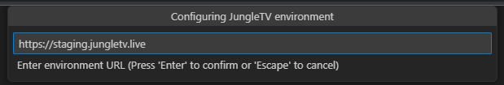
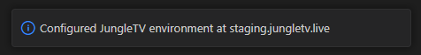
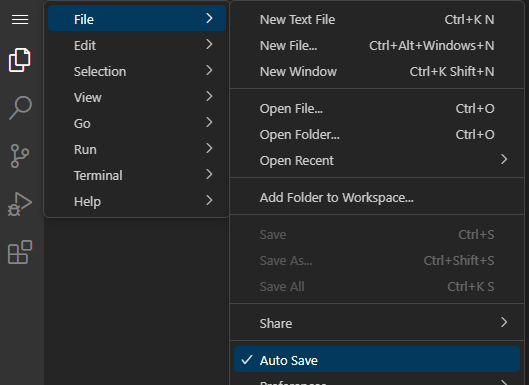

# Development environments and editors

The JungleTV Application Framework largely consists on an integration of preexisting technologies - like the JavaScript programming language and the gRPC framework.
Despite the familiar technologies, you will certainly want to interact with an actual instance of the target environment - JungleTV - while developing your applications.
That's where development environments come into the picture.

Similarly, while in theory one can develop JAF applications entirely independently from JungleTV, as long as one can create text files and compress them in a ZIP file (as described in the [import and export section](./import_export.md)), you will most likely want to use tools built specifically for the framework.
We have developed multiple options for more comfortably editing, debugging and managing applications.

## Development environments

Generally speaking, a JungleTV environment corresponds to an instance of the JungleTV server and client software, running with all of its dependencies properly configured.
In the context of the JAF, a development environment is one designed with application development and testing in mind.
This is in contrast with the production environment corresponding to the main [JungleTV website](https://jungletv.live), where approved applications will run, but no development activities are expected to be carried out.

A development environment will let you use [application editors](#editors) and will let you execute your in-development applications in a private or semi-private context, without affecting the official JungleTV service in any way.

### The staging lab environment

A "lab environment" is one that is almost identical to the production environment, but has minor changes to simultaneously make application development and testing easier, and discourage the normal use the official website gets.

Specifically, in a lab environment:

- Users are unable to withdraw the rewards they receive.
  The system can still take payments, but all amounts received go towards the upkeeping of the lab environment and JAF as a whole.
  The intention is to discourage users from amassing on the environment in hopes of receiving rewards.
- A wider group of users is able to obtain full staff privileges.
  The intention is to make it possible for application developers to not only manage (edit/launch) their applications, but also to change the website settings as needed in order to test their application under different scenarios.
- The cost of actions that require actual currency may be greatly reduced by the aforementioned users with staff privileges, the system may use test currency instead, or these users may be able to bypass the need for payment entirely.
- Some data for the environment may be reset periodically, without affecting application files but including rotation of signature keys involved in authentication processes (in other words: you may need to re-register to "receive rewards" somewhat frequently).
- Internally, the environment is more lenient on [CORS](https://developer.mozilla.org/en-US/docs/Web/HTTP/CORS) checks to allow tools like the [VS Code-based web editor](#vs-code-based-web-editor) to be used.

A lab environment will typically be available on the internet, and may be accessible by everyone or limited to a restricted set of people.
This is in contrast with [running JungleTV locally](#locally-running-jungletv), which is a more personal experience by default.

The JungleTV team hosts a lab environment at **https://staging.jungletv.live**.
To obtain staff/developer privileges on this environment, and instructions on how to use it, interested developers should contact the JungleTV team.

#### Staging Environment Etiquette

Because the staging lab environment is shared by multiple application developers - including the JungleTV team - it is important to be respectful of other users.
We have established the following guidelines to make the experience as smooth as possible:

- Do not mess with other people's applications.
  While there is no technical feature stopping you from going through the files of others' applications, you should keep common decency in mind, and that code and assets are copyrighted by default, even if they are technically available for you to see.
- Backup ([export](./import_export.md)) your applications often, if you are using this as your primary development environment.
- People who are not developing or helping to test applications do not belong on the staging environment.
- The staging environment keeps all the Banano sent to it, but application developers should feel free to set the price multipliers to the minimum in order to spend the least amount of funds when testing.
- Do not "play moderator" - don't mess with other people's accounts unless you have a legitimate reason to do so, motivated by application development activities. You are, of course, free to explore the functionality available to JungleTV staff, as long as you do not disturb other fellow developers.
- Try to keep enqueuing disabled (red **"Disable media enqueuing"** button in the moderation dashboard) and chat disabled (red **"Disable chat"** button) unless you need them enabled for testing, and make sure to disable them once you're done.

Not following these guidelines is likely to result in being prevented from interacting with this environment.

### Locally running JungleTV

If you do not have access to the staging lab environment or if the idea of using a shared environment to develop applications sounds unappealing to you, an option is to run the JungleTV software locally.
The JungleTV license happily allows this, as long as you do not publicly host a derivative JungleTV service without consent from the JungleTV developers.

While the process is not very streamlined, the [documentation](https://github.com/tnyim/jungletv/blob/master/docs/dev.md) should point you in the right direction.
(Improvements and updates to this documentation are always welcome, of course.)

Note that, to use the [VS Code-based web editor](#vs-code-based-web-editor), the HTTPS configuration of your local instance must be trusted by your system, i.e. there can be no browser warnings and you should get the "green padlock", when accessing the locally running JungleTV environment.
One easy way to achieve this, is to use [mkcert](https://github.com/FiloSottile/mkcert) to generate the TLS certificates to be used by your local environment.
mkcert takes care of installing a local CA in your system, which means that browsers (and VS Code) will consider the generated certificates to be locally-trusted and therefore cross-origin requests to the local environment, such as those done by the web editor, will succeed.

## Editors

Editors interact with a running JungleTV environment to edit [application files and properties](./applications_and_files.md) and launch, stop and monitor JAF applications.
Most of the development effort of a JAF application will likely involve interacting with one of these editors.

### Built-in application manager

This is the primary way of interacting with the JungleTV AF backoffice.
When it comes to JAF-specific aspects, the application manager and editor built into the JungleTV client SPA is the most powerful and direct of all available editing options.
It lets one view and control each application and their files, including their JAF-specific properties, and is the only supported interface for [importing and exporting applications](./import_export.md).

The built-in web editor can be accessed at the `/moderate/applications` path of an executing JungleTV environment.

A notable functionality of the application manager is the ability to see the console of running applications, to which applications can send debug messages and interactively run JavaScript within each application.

Unfortunately, this manager does not offer the best code editing experience, offering just a rather basic code editor (based on [CodeMirror](https://codemirror.net/)) with limited quality-of-life features.
For example, it lacks rich autocomplete for JAF native modules and your own source code, and does not perform any syntax or type checking.
It is meant as a last-resort option for quick edits.

Intensive file management is also not very comfortable in this editor, which has limited drag-and-drop capabilities, cannot perform bulk operations on files, and does not support the most common keyboard shortcuts for file management.

### VS Code extension

For a code editing experience much superior to what the built-in editor could hope to achieve - at least, without turning into a much larger project than JungleTV itself - a [Visual Studio Code](https://code.visualstudio.com/) extension was developed, allowing for a much more integrated application development experience.

The extension is not published in any VS Code extension marketplace, but its [source code is available on GitHub](https://github.com/tnyim/jungletv-vsc/).
The reason why will become evident later on.

This extension presents JungleTV application files as a virtual filesystem within VS Code.
This means there are some limitations compared to editing local files, but the file management story is generally better, in comparison with the application manager built into JungleTV.
For example, dragging and dropping files into the VS Code file explorer, and out of it, is possible, as is selecting multiple files.
Certain JAF-specific aspects (like setting file MIME types) are not natively supported within VS Code, but the extension adds context menu options to manage these.

The extension also presents itself as a "debugger."
While "true" step debugging of JAF applications is not possible at this moment, what the extension does is present the application console as the debug console, allowing it to be used within VS Code, including the evaluation of JavaScript expressions.

For improved autocomplete and type checking functionality when writing JavaScript and especially TypeScript, the extension downloads TypeScript declarations from the JungleTV environment(s) where you are editing applications, and tries to present those declarations to the relevant language services.

Due to limitations in the built-in support VS Code has for JavaScript and TypeScript, when running as a regular desktop install (i.e. not web based), there is unfortunately limited code completion and type checking features, compared to what would normally be available when editing regular files on your computer.
Because of this, we don't actually recommend installing the extension in regular VS Code - even though all of the features provided by the extension itself will work perfectly.
Read on for the recommended approach.

### VS Code-based web editor

To work around the limitations of VS Code's built in support for the TypeScript language when editing files on virtual file systems, and to further lower the barrier to entry for JAF application development, a custom distribution of VS Code was developed, designed for use in web browsers.
This distribution comes with the [aforementioned extension](#vs-code-extension) preinstalled.

This editor is available online, at **https://editor.jungletv.live**.
It works better in browsers based on the Blink browser engine (e.g. Chromium, Chrome), as that is what VS Code is designed for.

> **Aside**: This custom distribution of VS Code works around the TypeScript language support woes, by disabling the built-in support and using [this extension](https://github.com/volarjs/vscode-typescript-web) instead.
> Unfortunately, this extension does not work when VS Code is running in a non-web context, so it is not a suitable workaround for the problems experienced when using VS Code proper.
> The source code for the custom distribution of VS Code is available [on GitHub](https://github.com/tnyim/jungletv-github1s).
> It is based on [github1s](https://github.com/conwnet/github1s).

:information_source: Do not be worried about the web-based nature of this editor, as it is quite powerful and sufficiently performant.
**It is effectively the recommended primary tool for the development of JAF applications of any moderate complexity.**
Of course, you will likely still need to use the [built-in application manager](#built-in-application-manager) for certain operations.

The beauty of this editor is that it offers an application development experience comparable to that of a desktop environment (or actually superior, due to the aforementioned workaround), even on devices that are limited in their support for desktop software, such as tablets and Chromebooks.
Like with the [built-in application manager](#built-in-application-manager), developers are not required to install any specific software in order to begin developing JAF applications.

#### Using the editor

When you open the editor for the first time, you'll be presented with the empty state of a VS Code window.
In addition to the usual options to open folders - meant for local folders and unrelated to the JAF capabilities - the sidebar will show a button to configure a JungleTV environment:

Pressing this button will prompt you to enter a JungleTV environment URL.
If using the [staging environment](#the-staging-lab-environment), you should enter `https://staging.jungletv.live`.

Next, you'll be sent to a page on the environment you are trying to configure.
(You may need to allow pop-ups to get the page to open.)
If you are properly authenticated on this environment, you should be able to press the "Authorize" button on that page.
If you are using a different browser for the editor that is not the one where you are authenticated on the environment, you can simply copy and paste the URL of the page to the other browser.

> If you later need to revoke this authorization, you can access the rewards page on the environment you are using, scroll to the end and press "Sign out everywhere."

Back to the editor, it should report it has connected to the environment:

You can now add a JAF application to the VS Code workspace, by pressing the "Open JungleTV Application" button on the file explorer side panel, or by opening the command palette (F1) and using the command "JungleTV AF: Add Application to Workspace".
You can also configure additional environments.
You may open multiple JAF applications simultaneously on the VS Code workspace, even if they are from multiple environments, and you are even able to copy files between them, through the VS Code file explorer.

> **Tip**: The JungleTV AF VS Code extension will prompt you for an edit message every time you save a file.
> This can quickly become annoying if auto-saving is enabled.
> You can disable auto-save in the VS Code File menu:
>
> 

In addition to editing JungleTV application files, you can right-click the applications in the Explorer view in order to launch/stop them, connect to their console and open their page in the [application manager](#built-in-application-manager).
You can edit JAF-specific file metadata (e.g. MIME types) by right-clicking the files in the Explorer view.