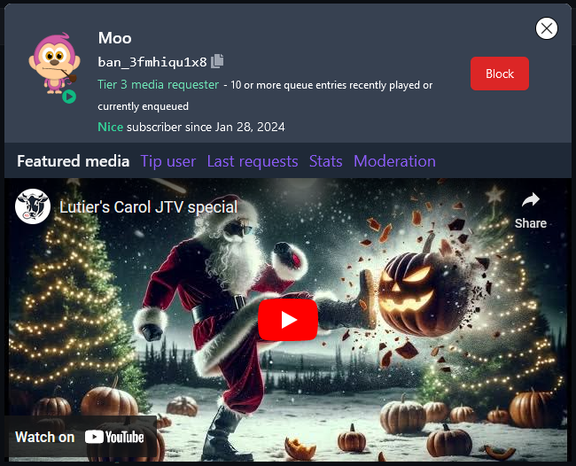

# Users and profiles

Most JungleTV AF applications come into contact with the concept of JungleTV users.
Users appear associated with different aspects of the JAF, like the [remote methods and events](./rpc.md) presented in the previous section, and the [chat messages](./chat.md) and [queue entries](./queue.md) that will be detailed in forthcoming sections.

A JungleTV user corresponds to either a single human (ideally) who uses or otherwise interacts with JungleTV, or to another JungleTV AF application.
Each user is identified by their Banano account address, which in turn is a representation of the public portion of the private key that gives them access to the funds in that Banano account.
JAF applications too have a Banano account associated with them, to which they have limited access, via the [wallet](TODO) functionality.

Since there is no requirement for strong identity verification when interacting with JungleTV, it is possible for users to interact with the service using multiple Banano addresses, and for multiple humans to use the same Banano address to interact with the service.
Still, when it comes to application interface design, applications should assume that each Banano address corresponds to a different identity.
Meanwhile, when it comes to abuse prevention, it is likely a good idea to forego this assumption.

## User identity

JungleTV users are uniquely identified by their Banano account address.
This simplifies the logic both in JAF applications and within JungleTV itself, and has other arguable advantages like allowing the service "sign-up"/"sign-in" methods to revolve around proving one's ownership of a Banano account, without needing to involve email addresses or passwords.
However, this approach also comes with downsides, like being unable to change the Banano address associated with a JungleTV account, and users losing access to their JungleTV account if they lose the private key of their Banano account.
At this point in the life of JungleTV, it is unlikely that this design will change - it is, after all, not too different from the pattern followed by many "decentralized", cryptocurrency-related tools and services.
JAF applications should _not_ take it upon themselves to sort out the downsides of this approach - there is no need for applications to provide "user data migration" tools, for example.

Users are also associated with a nickname, which is most prominent when they enqueue media and when they participate in the chat, and with a permission level, that essentially indicates whether they are regular users or staff members.
Nicknames can be changed at any point and different users may share a nickname - although there are some protections in place, to avoid having regular users that share the same nickname as a staff member, in order to help prevent staff impersonation.

To JAF applications, users are typically presented as [User objects](../reference/server/common_types.md#user-object) containing these additional fields that are commonly accessed when dealing with user identities.
Somewhat contradictorily, in certain contexts these user objects may contain non-Banano account addresses, in which case their `isFromAlienChain` field will be set to true.
This is because some components, like the [media queue](./queue.md), sometimes need to represent non-authenticated users, including from other systems.
Namely, queue entries may be enqueued without authenticating on the service, in which case they are attributed as having been requested by the address that paid for them - which may be from a different network.

> **Note**: always compare users based on their address and not the reference to the user object or any other fields, that may be different depending on the origin of each specific user object.
>
> **Do**:
> ```js
> if (userA.address === userB.address) { /* Users are the same identity */ }
> ```
>
> **Do not**:
> ```js
> if (userA === userB) { /* This condition will rarely be true */ }
> if (userA.nickname === userB.nickname) {
>   /* Different users may have the same nickname! */
> }
> ```

Because JAF applications may perform some of the same actions that human users can, like sending chat messages and enqueuing media, they too have a Banano address associated with them, so they can be attributed as users within JungleTV.
This is the address of the [Banano account](TODO) that is managed by the JAF and to which they have limited access.
Application user objects have their `applicationID` field set to the ID of the corresponding application.

Applications too have a nickname which they can set, via the [`nickname` property of the `jungletv:chat` module](../reference/server/jungletv_chat.md#nickname), or via the [`setUserNickname()` function of the `jungletv:profile` module](../reference/server/jungletv_profile.md#setusernickname).
The latter function can be used to set the nickname of arbitrary users, and to set their own nickname, applications will have to use the [`address` associated with their wallet](../reference/server/jungletv_wallet.md#address).

When regular users do not have a nickname set, they are primarily identified in the JungleTV client UI by the first 14 characters of their Banano address.
JAF applications should implement the same pattern whenever they need to identify users, throughout their [application pages](./pages.md).
Meanwhile, when JAF applications do not have a nickname set, they are typically primarily identified in the UI by their [application ID](./applications_and_files.md#application-properties).

## User profiles

In addition to setting a nickname, users can associate two more pieces of information with their JungleTV accounts, which are displayed as part of their user profile on the JungleTV client SPA, whenever users click for more details on a user (for example, as part of the detail on a queue entry, a chat message, or a leaderboard entry):

- A "biography," which is up to 512 bytes of arbitrary Unicode plain text, that is **not** parsed as Markdown by the JungleTV client UI;
- A featured media, which is media that has previously played on the service.
  This is specified and stored as the `id` of a past [media performance](../reference/server/jungletv_queue.md#media-performance-object).
  Application pages cannot be used as featured media.



In general, it is expected that the users themselves will be the only ones changing their nickname and these two fields on their profile.
When they constitute unacceptable content, JungleTV staff may clear these fields off the profile of any user, via the "Moderation" tab visible in the screenshot above.
Mainly to enable automatic moderation use cases, applications can set the nickname, biography and featured media of any user, via the `setUserNickname()`, `setProfileBiography()` and `setProfileFeaturedMedia()` functions of the [`jungletv:profile` module](../reference/server/jungletv_profile.md).
Applications may also alter these fields upon explicit and informed user consent.

Similarly to regular users, JAF applications have a profile too, with some differences: the elements to tip the user, show the user's statistics, and see the list of recent media requests are not available for application profiles.
Applications may set the "biography" and a featured media on their profile via the aforementioned functions, by passing [`address` associated with their wallet](../reference/server/jungletv_wallet.md#address) as the address in the arguments.

The general JungleTV community guidelines apply for content set on user profiles, including application profiles.