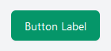
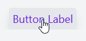
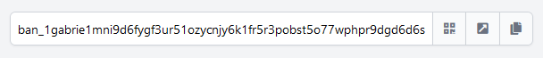
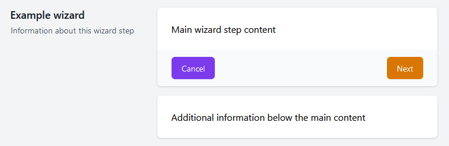
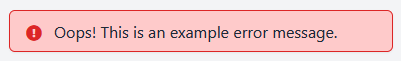
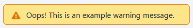
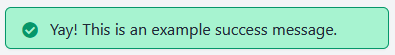

# App bridge custom elements reference

This section contains a reference for the custom HTML elements registered by the [app bridge script](../../manual/pages.md#client-side-framework-appbridge) in the pages where it is loaded.
These are JungleTV-themed UI elements, meant to ease the process of implementing a JungleTV-themed application page.
Their appearance will automatically change to match whether the parent JungleTV page has dark mode enabled.

The app bridge script automatically loads additional CSS rules in the page context, whenever one of these custom elements is used.
The additional CSS rules may change the style of other elements of your application page beyond the custom elements.

Custom elements are implemented using Svelte.
Their implementation is the same one used by the JungleTV SPA, but while on the JungleTV SPA they are all part of the same Svelte context, on application pages they are adapted into [Web Components](https://developer.mozilla.org/en-US/docs/Web/API/Web_components) and their behavior may differ slightly.

The documented aspects of the elements constitute their "guaranteed" API when it comes to the JungleTV AF.
These components often expose additional properties, and a look at their implementation can be useful for clearing up any doubts about their workings.
However, you should keep in mind that undocumented aspects are likely to change in any JungleTV update, without such changes being reflected in [framework versioning](../../manual/framework_versioning.md).

## `jungletv-button`

A simple button that can have different colors.

**[Implementation](https://github.com/tnyim/jungletv/blob/master/app/src/uielements/ButtonButton.svelte)**

#### Example

```html
<jungletv-button color="green">
    Button Label
</jungletv-button>
```



#### Slots

This element contains a single unnamed slot with no default content, corresponding to the content inside the button.

#### Attributes

- `color` - A string defining the color of the button.
  Can be one of `gray`, `red`, `yellow`, `green`, `blue`, `indigo`, `purple` or `pink`.
  Defaults to `yellow`.
- `type` - A string defining the default behavior of the button, passed to the underlying [`<button>` element](https://developer.mozilla.org/en-US/docs/Web/HTML/Element/button).
  Defaults to `button`.
- `disabled` - A boolean preventing the user from interacting with the button, passed to the underlying `<button>` element.
- `extraClasses` - A string containing additional CSS classes to apply on the underlying `<button>` element.

#### Events

- `click` - Occurs when the button is clicked; matches the event with the same name of the underlying `<button>` element.

## `jungletv-tab-button`

A tab-styled button, as used in the JungleTV homepage sidebar.

**[Implementation](https://github.com/tnyim/jungletv/blob/master/app/src/uielements/TabButton.svelte)**

#### Example

```html
<div class="flex flex-row">
    <jungletv-tab-button>
        Button Label
    </jungletv-tab-button>
</div>
```



#### Slots

This element contains a single slot with no default content, corresponding to the content inside the button.

#### Attributes

- `selected` - A boolean indicating whether the button is in an "active" state (typically corresponding to whether the associated tab pane is visible).
- `extraClasses` - A string containing additional CSS classes to apply on the underlying `<button>` element.

#### Events

- `click` - Occurs when the button is clicked; matches the event with the same name of the underlying `<button>` element.
- `mousedown` - Matches the event with the same name of the underlying `<button>` element.

## `jungletv-payment-address`

A component able to display a Banano or Nano address in such a way that it is easily actionable.
It is possible to display a QR code along with the address, or associate a suggested payment amount with it.

**[Implementation](https://github.com/tnyim/jungletv/blob/master/app/src/uielements/AddressBox.svelte)**

#### Example

```html
<jungletv-payment-address
    address="ban_1gabrie1mni9d6fygf3ur51ozycnjy6k1fr5r3pobst5o77wphpr9dgd6d6s"
    allowQR="true">
</jungletv-payment-address>
```



#### Slots

This element has a single unnamed slot with no default content, where content may be placed to be displayed below the address bar and before the web wallet links and/or QR code.

#### Attributes

- `address` - Mandatory string containing the Banano or Nano address to display.
- `allowQR` - Boolean controlling whether the user can press a button to toggle the visibility of a QR code for the address.
  Defaults to false.
- `showQR` - Boolean controlling whether the QR code for the address should be displayed by default.
  Defaults to false.
  The QR code is shown below the address box.
- `showWebWalletLink` - Boolean controlling whether a helper link to a web wallet should be shown, for the user to initiate a payment.
  Defaults to false.
  The link is shown below the address box.
  The web wallet in question may change at any moment without the change being reflected in [framework versioning](../../manual/framework_versioning.md).
- `paymentAmount` - A string containing a raw amount, i.e. an integer value in the smallest units of the currency, that is the suggested payment to use in the web wallet link and the QR code.
  Defaults to no amount, i.e. a specific payment amount will not be suggested.

## `jungletv-wizard`

A component that allows for laying out content in a [wizard](https://en.wikipedia.org/wiki/Wizard_(software))-like fashion.
This component should be used inside a flex container.
This component is used in JungleTV SPA pages such as the enqueue page and the rewards page.

**[Implementation](https://github.com/tnyim/jungletv/blob/master/app/src/uielements/Wizard.svelte)**

#### Example

```html
<div class="flex justify-center">
    <jungletv-wizard>
        <div slot="step-info">
            <h3 class="text-lg font-semibold leading-6 text-gray-900 dark:text-gray-200">
                Example wizard
            </h3>
            <p class="mt-1 text-sm text-gray-600 dark:text-gray-400">
                Information about this wizard step
            </p>
        </div>
        <div slot="main-content">
            Main wizard step content
        </div>
        <div slot="buttons" class="flex items-center flex-wrap">
            <jungletv-button color="purple">Cancel</jungletv-button>
            <div class="flex-grow"></div>
            <jungletv-button>Next</jungletv-button>
        </div>
        <div slot="extra_1" class="shadow sm:rounded-md sm:overflow-hidden">
            <div class="px-4 py-5 bg-white dark:bg-gray-800 space-y-6 sm:p-6">
                Additional information below the main content
            </div>
        </div>
    </jungletv-wizard>
</div>
```



#### Slots

This element has a total of eight named slots, two of which should always be filled with content.

- `step-info` - The content shown to the left of the main content (or above, in narrow screens).
  Typically used to present contextual help about the current wizard step.
  This slot should always have content.
- `main-content` - The main content of the wizard.
  Typically used to present the information and actionable UI elements that are most relevant to the current wizard step.
  This slot should always have content.
- `buttons` - The bar shown below the main wizard content.
  Typically contains buttons for navigation in the wizard.
  Content for this slot may be omitted, in which case the bar does not appear.
- `extra_1` through `extra_5` - These slots may optionally be used to render additional content below the wizard, in alignment with the main wizard content.

#### Attributes

This element has no attributes.

#### Events

This element emits no events.

## `jungletv-error`

An error message component.

**[Implementation](https://github.com/tnyim/jungletv/blob/master/app/src/uielements/ErrorMessage.svelte)**

#### Example

```html
<jungletv-error>
    Oops! This is an example error message.
</jungletv-error>
```


#### Slots

This element contains a single unnamed slot with no default content, corresponding to the content inside the bubble.

#### Attributes

This element has no attributes.

#### Events

This element emits no events.

## `jungletv-warning`

A warning message component.

**[Implementation](https://github.com/tnyim/jungletv/blob/master/app/src/uielements/WarningMessage.svelte)**

#### Example

```html
<jungletv-warning>
    Oops! This is an example warning message.
</jungletv-warning>
```


#### Slots

This element contains a single unnamed slot with no default content, corresponding to the content inside the bubble.

#### Attributes

This element has no attributes.

#### Events

This element emits no events.

## `jungletv-success`

A success message component.

**[Implementation](https://github.com/tnyim/jungletv/blob/master/app/src/uielements/SuccessMessage.svelte)**

#### Example

```html
<jungletv-success>
    Yay! This is an example success message.
</jungletv-success>
```


#### Slots

This element contains a single unnamed slot with no default content, corresponding to the content inside the bubble.

#### Attributes

This element has no attributes.

#### Events

This element emits no events.